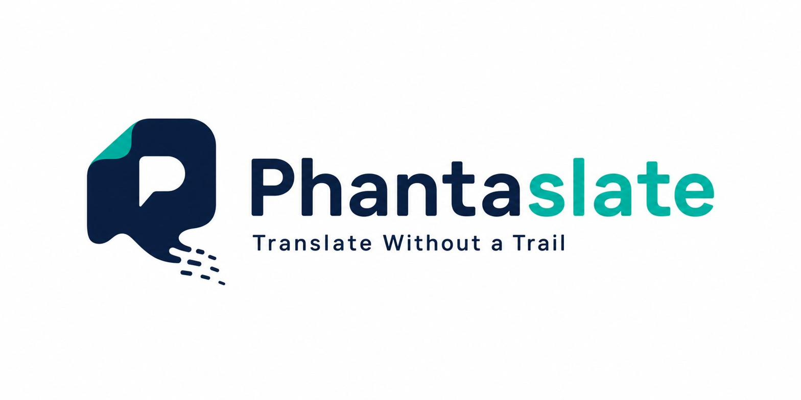
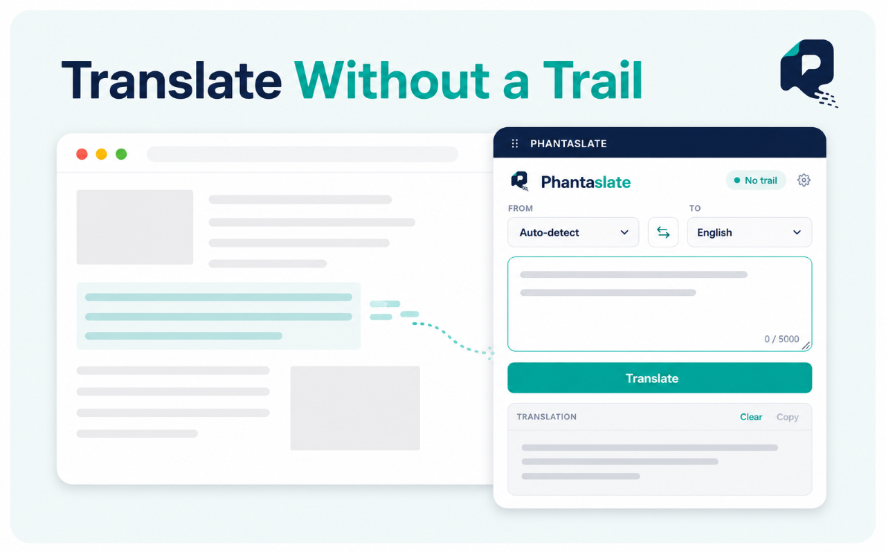
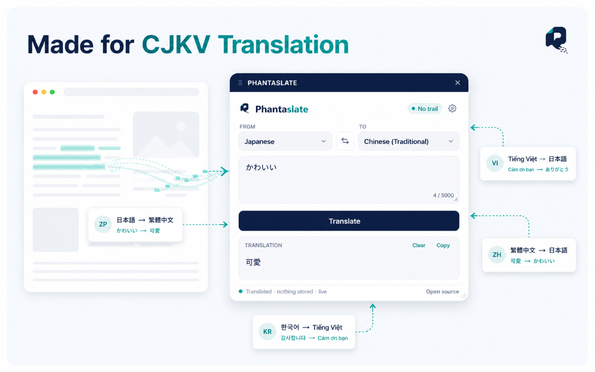
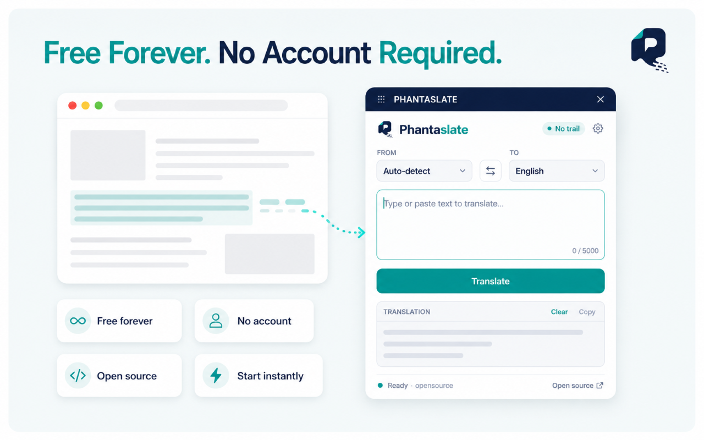

<p align="center">
  
</p>

<h1 align="center">Phantaslate</h1>

<p align="center"><strong>Translate Without a Trail.</strong></p>

<p align="center"><em>Your words should serve you. Not study you.</em></p>

<p align="center">
  
  
  
  
  
</p>

---

Phantaslate is an open-source, privacy-first translation tool. Your words are
yours — we keep no logs, we publish everything we do, and we let you verify it.

The extension is **free forever**. No paid tier, no upsell.

<p align="center">
  
</p>

---

## ⚠️ Current status

**v1.1.0 — live on the Chrome Web Store, hosted relay live, phantaslate.com live.**

Install from the [Chrome Web Store](https://chromewebstore.google.com/detail/phantaslate-translate-wit/nmekbfmjegpjkpkobippkkbnnlhimijm) —
no local setup, no self-hosting required. The extension ships pointed at the
hosted relay at `api.phantaslate.com`. Self-hosting remains fully supported
for anyone who wants their text to touch nothing but their own server (see
[Self-hosting](#self-hosting)).

| Component | State |
|---|---|
| Browser extension (Chrome / Chromium, Manifest V3) | ✅ Working |
| Stateless relay (FastAPI, self-hostable) | ✅ Working |
| End-to-end translation | ✅ Working |
| Draggable in-page panel | ✅ Working |
| Auto-detect + wrong-source-language warning | ✅ Working |
| Hosted relay (no setup required) | ✅ Live at `api.phantaslate.com` |
| Chrome Web Store listing | ✅ Live |
| phantaslate.com homepage | ✅ Live |
| Anonymous rate limiting (fair-use caps, global budget breaker) | ✅ Live |
| Multiple model providers | 🚧 In progress |
| Bring your own API key | 📋 Planned |
| Firefox support | 📋 Planned |
| Desktop & mobile apps | 📋 Planned |

Prefer building from source, or want to point the extension at your own
relay? See [Running it locally](#-running-it-locally) below.

---

## Why Phantaslate?

| Problem | Phantaslate's answer |
|---|---|
| Mainstream translation is tied to advertising and profiling businesses | Stateless relay — nothing is written to disk |
| Some services are unreliable or unavailable in certain regions | Self-hostable relay; provider choice in progress |
| Translation tools have leaked user text through insecure convenience features | No stored artifacts to leak — there is nothing to expose |
| CJKV translation often pivots awkwardly through English | Models chosen for direct CJKV quality — no English pivot |

> On the third point: in August 2025 a widely used translation extension
> exposed large volumes of user content — reportedly including personal
> details and credentials — because a page-snapshot feature uploaded data to
> publicly readable cloud storage with no access control. It was a design
> flaw, not an intrusion. That distinction is the entire argument for building
> a tool that keeps nothing in the first place.

---

## Features

- 🔒 **Private by architecture** — the relay holds no database and writes no
  translation logs
- 🌏 **CJKV-first** — Chinese (both scripts), Japanese, Korean and Vietnamese
  treated as first-class, not afterthoughts
- 🎯 **9 languages** — focused and done well, rather than a hundred done poorly
- 🔍 **Fully auditable** — every line is open, extension and relay alike
- 🖱️ **Draggable in-page panel** — stays open while you work, remembers its
  position and size
- 🧠 **Wrong-language detection** — if your text isn't the language you
  selected, it tells you and offers to fix it
- 🏠 **Self-hostable** — run the whole relay yourself; your text never touches
  anyone else's server
- 🆓 **Free forever** — the extension has no paid tier

<p align="center">
  
</p>

---

## Supported languages

Auto-detect, plus nine target languages:

| Code | Language |
|---|---|
| `en` | 🇺🇸 English |
| `zh-Hans` | 🇨🇳 Chinese (Simplified) |
| `zh-Hant` | 🇭🇰 Chinese (Traditional) |
| `ja` | 🇯🇵 Japanese |
| `ko` | 🇰🇷 Korean |
| `vi` | 🇻🇳 Vietnamese |
| `es` | 🇪🇸 Spanish |
| `fr` | 🇫🇷 French |
| `de` | 🇩🇪 German |

Up to 5,000 characters per translation, 30,000 characters per day — the same
limits whether you're using the extension or phantaslate.com. Russian and
Arabic (with RTL rendering) are candidates for a later release.

---

## Architecture

```
Your text
    │
    ▼
Browser extension          in-page panel, ~80 KB
    │                      nothing persisted but your settings
    ▼
Phantaslate relay          open source · stateless · self-hostable
    │                      no database · no content logging
    ▼
Model API                  DeepSeek (deepseek-v4-flash) today
    │                      second provider in progress · your own key planned
    ▼
Translation returned  →  rendered locally  →  nothing kept
```

**The relay is stateless by design.** It receives text, calls the model API,
returns the result, and writes nothing to disk. The container even runs with
access logging disabled, so request paths stay out of the logs too. If the
server were compromised, there would be nothing stored to take.

The hosted relay runs the same code in this repository, deployed in a
container. Nothing about the hosted deployment differs from what you can run
yourself — that's the point of publishing it.

---

## 🚀 Running it locally

Since v1.0.0 the extension ships pointed at the hosted relay, so **step 2 is
all you need** to try it. Step 1 is for self-hosting or relay development.

### 1. The relay *(optional — only for self-hosting)*

Requires Python 3.10+ and a [DeepSeek API key](https://platform.deepseek.com).

```bash
cd relay
python -m venv .venv

# Windows
.venv\Scripts\activate
# macOS / Linux
source .venv/bin/activate

pip install -r requirements.txt
```

Set your key, then start it:

```bash
# Windows (PowerShell)
$env:DEEPSEEK_API_KEY="sk-..."
# macOS / Linux
export DEEPSEEK_API_KEY="sk-..."

uvicorn main:app --reload --port 8000
```

Confirm it's alive at <http://localhost:8000/health>.

Or with Docker:

```bash
cd relay
docker build -t phantaslate-relay .
docker run -p 8000:8000 -e DEEPSEEK_API_KEY="sk-..." phantaslate-relay
```

Then point the extension at `http://localhost:8000` via the gear icon.

### 2. The extension

1. Open `chrome://extensions`
2. Enable **Developer mode** (top right)
3. Click **Load unpacked** and select the `extension` folder
4. Open any website and click the Phantaslate toolbar icon

The panel opens inside the page. Drag it by its title bar, resize it from the
corner, and close it with ✕. The gear icon lets you point the extension at a
different relay.

### Tests

```bash
cd relay
pip install pytest
pytest -q
```

The suite runs offline — no API key and no network needed.

---

## Configuration

Relay environment variables:

| Variable | Required | Default | Purpose |
|---|---|---|---|
| `DEEPSEEK_API_KEY` | yes | — | API key (never commit it) |
| `PHANTASLATE_MODEL` | no | `deepseek-v4-flash` | Model name |
| `DEEPSEEK_BASE_URL` | no | `https://api.deepseek.com` | API base URL |
| `PHANTASLATE_ORIGINS` | no | `*` | Allowed extension CORS origins (`chrome-extension://...`) |
| `PHANTASLATE_WEB_ORIGINS` | no | `https://phantaslate.com,https://www.phantaslate.com` | Allowed website CORS origins |

`PHANTASLATE_ORIGINS` defaults to `*` for local development convenience. Any
public deployment should set it to the specific extension origin(s) it serves,
comma-separated — e.g. `chrome-extension://<your-extension-id>`.

Multi-provider support will add per-provider key and base-URL variables; this
table will grow when that lands.

### Rate limiting

Fair-use limits are enforced anonymously — no accounts, no cookies, no
durable identity — by [`relay/ratelimit.py`](relay/ratelimit.py). Full design
notes live in the module's own docstring; the short version:

| Variable | Default | Purpose |
|---|---|---|
| `PHANTASLATE_SALT_SECRET` | random at boot | Secret for identity hashing. **Set this in production** — unset, quotas reset on every deploy. |
| `PHANTASLATE_DAILY_CHARS` | `30000` | Per-install daily cap, extension |
| `PHANTASLATE_WEB_DAILY_CHARS` | `30000` | Per-session daily cap, website |
| `PHANTASLATE_WEB_MAX_CHARS` | `5000` | Per-request cap, website (matches the extension) |
| `PHANTASLATE_IP_MULTIPLIER` | `25` | Per-network ceiling, as a multiple of the daily cap — loose on purpose, so it takes many addresses to matter, not one shared office |
| `PHANTASLATE_DAILY_BUDGET_USD` | `2.00` | Global daily spend ceiling — the actual cost control. Caps run generous per-user precisely because this bounds the bill directly. |
| `PHANTASLATE_COST_PER_MCHARS` | `0.12` | Assumed provider cost per million characters, used to convert the budget above into a character count |
| `PHANTASLATE_MAX_TRACKED` | `500000` | Max distinct identities held in memory (~80 MB at default) |
| `PHANTASLATE_FAIL_OPEN` | unset (refuse) | At memory capacity: refuse new identities (default) or admit them uncounted (`1`) |

Two identifiers are checked per request — a caller token (install ID or
session ID) and a hashed, salted IP — plus the global budget above them. All
three are checked before anything is charged, so a rejected request never
costs quota or money. No raw IP address is ever stored: addresses are
normalised (IPv6 to its `/64`), hashed with the day and the secret, and the
resulting key cannot be correlated across days or reversed to the original
address.

The extension and the website share one cap structure as of business plan
v4.0 — see [`Phantaslate_Business_Plan_v4.md`](Phantaslate_Business_Plan_v4.md)
for the reasoning, largely: a per-user cap bounds nothing on its own, since it
doesn't know how many users exist; the global budget is what actually bounds
the bill, which is what lets the per-user figures be generous.

---

## API

### `POST /translate`

```json
{ "text": "Bonjour le monde", "source_lang": "auto", "target_lang": "en" }
```

```json
{
  "translation": "Hello world",
  "detected_lang": "French",
  "detected_code": "fr",
  "source_mismatch": false
}
```

`source_mismatch` is `true` when the text isn't written in the language you
said it was — the extension surfaces this as a warning and offers to correct
the setting.

### `GET /health`

Returns status and active model. Reveals no request content.

---

## Roadmap

| Milestone | Scope | Status |
|---|---|---|
| Extension shell | Manifest V3 popup and panel UI | ✅ Done |
| Stateless relay | FastAPI, self-hostable, Dockerised | ✅ Done |
| End-to-end translation | Extension ↔ relay integration | ✅ Done |
| Hosted relay | Deployed default so no setup is needed | ✅ Done |
| Web Store release | Chrome Web Store submission | ✅ Done |
| phantaslate.com | Project homepage and docs | ✅ Done |
| Multi-provider | Switch freely between models | 🚧 In progress |
| Bring your own key | Use your own API key per provider | 📋 Planned |
| Firefox | Cross-browser support | 📋 Planned |
| V2 apps | Windows, macOS, Linux, Android, iOS | 📋 Planned |

See [ROADMAP.md](ROADMAP.md) for the detailed plan behind the next three
milestones, including the open architectural decisions.

The **extension** will remain free forever. Any future paid features would
live in the separate desktop and mobile apps, never here.

<p align="center">
  
</p>

---

## Self-hosting

Running your own relay means your text never touches anyone else's server —
the strongest privacy position available short of a fully local model. The
[relay README](relay/README.md) covers Docker, environment variables and
deployment notes.

The extension's gear menu lets you switch between the hosted relay and your
own instance at any time. Nothing about that choice is locked in.

---

## Contributing

Contributions are welcome. Please read [CONTRIBUTING.md](CONTRIBUTING.md)
before opening a pull request.

Especially valuable right now:

- Firefox compatibility (Manifest V3 differences)
- Translation quality review by native speakers, particularly CJKV pairs
- Additional model provider adapters
- RTL rendering groundwork for future Arabic support
- Documentation, and translations of the documentation itself

---

## License

Licensed under the **GNU Affero General Public License v3.0 (AGPL-3.0)**.

- ✅ Use, study and modify the code freely
- ✅ Run your own relay
- ✅ Fork and build on it
- ❌ You may not run a modified version as a closed proprietary service
  without releasing your changes

The AGPL is a deliberate choice: a privacy tool that could be forked into a
closed, logging service would undermine its own premise. See
[LICENSE](LICENSE) for the full text.

---

## Mission

> *Phantaslate exists because translation should never come at the cost of
> trust.*
>
> *We build an open, auditable, lightweight tool focused on the languages
> people actually use — including the CJKV pairs that big platforms route
> awkwardly through English.*
>
> *We keep no logs. We publish what we do. We let you verify it.*
>
> *Stateless by design. Private by architecture.*

---

<p align="center">
  <br>
  <strong>Present when needed. Gone without a trace.</strong><br><br>
  <a href="https://www.phantaslate.com">phantaslate.com</a>
</p>
